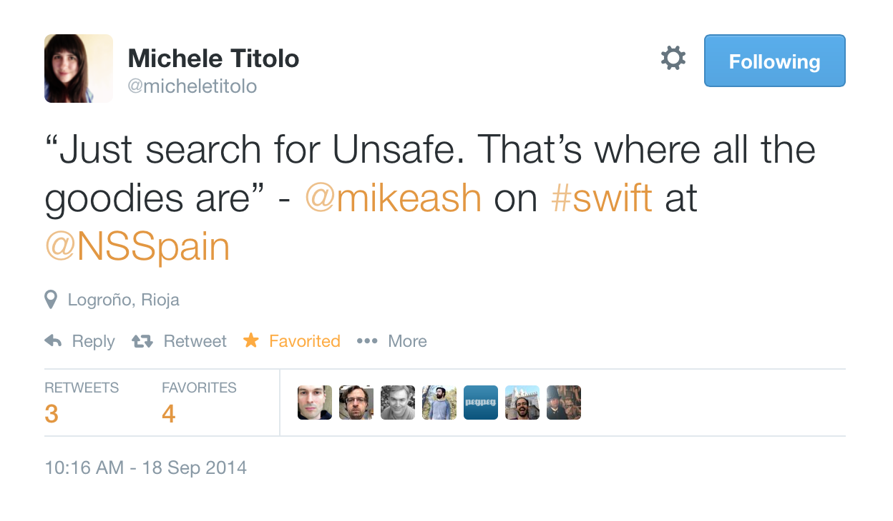

# Swift funtime

## mobiconf 2014

### Boris Bügling - @NeoNacho


---

## CocoaPods


---

## Contentful


---

## Swift


---

# Agenda

- How do you even Swift?
- What is a Swift object?
- Objective-C runtime in the age of Swift
- Swift runtime


---

>> “Swift’s clean slate [...] is an opportunity to reimagine how software development works.”


---

- Optionals
- Tuples
- Generics
- Pattern matching
- Operator overloading
- Namespaces
- Type inference
- ...


---

# emoji identifiers! 🎉

```swift
class 🍷 {
    func 💥() {
    }
}
```


---

# Interfaces with C, at full speed

## Watch *"Swift and C"* by Mike Ash



---

## Drops C++ interoperability

---

>> Everyone is a Beginner


---

- The Swift Programming Language *by *

### and also

- Swift by Tutorials: A Hands-On Approach
- Your First Swift App
- Functional Programming in Swift

---

# Swift command line tools

```
$ xcrun swift
Welcome to Swift!  Type :help for assistance.

$ xcrun swiftc Foo.swift
## will compile an executable

$ xcrun swift-stdlib-tool
## assembles libraries for an application bundle

$ xcrun swift-demangle _TtCSs29_NativeDictionaryStorageOwner
_TtCSs29_NativeDictionaryStorageOwner ---> Swift._NativeDictionaryStorageOwner
```


---

### *Let's drop close to the metal*


---

# What is a Swift object?


---

# It depends


---

```swift
class MyObject : NSObject {
}
```


---

- behaves like any old Objective-C object
- instance variables are *properties*
- fully interopable with ObjC


---


```swift
class MyObject {
}
```


---

- has *SwiftObject* as superclass
- instance variables are *ivars*
- methods are **not** ObjC methods
- not interoperable with ObjC


---

### Playground!

```
import ObjectiveC.runtime
```

but

```
Playground execution failed: Error in auto-import:
failed to get module 'runtime' from AST context
```

(rdar://problem/18482380)

---

# 😢🐼

---

### Demo: Inspect objects

---

### SwiftObject

Ivar: magic {SwiftObject_s="isa"^v"refCount"q}
Protocol: NSObject

### NSObject

Ivar: isa #
Protocol: NSObject


---

```swift
class MySwiftClass {
    var foo = "bar";

    init() {
    }
}

import Foundation
import ObjectiveC.runtime

var ivar = class_getInstanceVariable(MySwiftClass().dynamicType, "foo")
var value : AnyObject = object_getIvar(MySwiftClass(), ivar)!
```

Segmentation fault: 11

---

# value types should be *structs*

```swift
struct MyObject {
	var a : String
	var b : Array<Int>
}
```


---

## In pure Swift, there's no introspection 😭


---

## There is hope

```swift
/// How children of this value should be presented in the IDE.
enum MirrorDisposition {
    case Struct
    case Class
    case Enum
    case Tuple
    [...]
}

/// A protocol that provides a reflection interface to an underlying value.
protocol MirrorType {
	[...]

    /// Get the number of logical children this value has.
    var count: Int { get }
    subscript (i: Int) -> (String, MirrorType) { get }

    /// Get a string description of this value.
    var summary: String { get }

    [...]
}
```

---

# Objective-C runtime in the age of Swift

---

## Inherit from `NSObject` and it just works!

---

# Even swizzling 😱

---

```swift
import Foundation
import ObjectiveC.runtime

extension NSString {
    func swizzle_description() -> NSString {
        return "💥"
    }
}

var myString = "foobar" as NSString

println(myString.description)

var originalMethod = class_getInstanceMethod(NSString.self, "description")
var swizzledMethod = class_getInstanceMethod(NSString.self, "swizzle_description")

method_exchangeImplementations(originalMethod, swizzledMethod)

println(myString.description)
```

---

wat.jpg

---

## *Let's take a step back*


---

# Objects

```c
typedef struct objc_object {
	Class isa;
} *id;
```

---

# Classes

```c
struct objc_class {
	Class isa;

#if !__OBJC2__
    Class super_class                                        OBJC2_UNAVAILABLE;
    const char *name                                         OBJC2_UNAVAILABLE;
    long version                                             OBJC2_UNAVAILABLE;
    long info                                                OBJC2_UNAVAILABLE;
    long instance_size                                       OBJC2_UNAVAILABLE;
    struct objc_ivar_list *ivars                             OBJC2_UNAVAILABLE;
    struct objc_method_list **methodLists                    OBJC2_UNAVAILABLE;
    struct objc_cache *cache                                 OBJC2_UNAVAILABLE;
    struct objc_protocol_list *protocols                     OBJC2_UNAVAILABLE;
#endif
} OBJC2_UNAVAILABLE;
```

---

# Methods

```c
struct objc_method {
    SEL method_name                                          OBJC2_UNAVAILABLE;
    char *method_types                                       OBJC2_UNAVAILABLE;
    IMP method_imp                                           OBJC2_UNAVAILABLE;
} OBJC2_UNAVAILABLE;
```

---

# Method Implementations

```c
typedef struct objc_selector     *SEL;

typedef id (*IMP)(id self, SEL _cmd ,...);
```

---

# Message forwarding

```c
+(BOOL)resolveInstanceMethod:(SEL)aSEL;

-(void)forwardInvocation:(NSInvocation*)anInvocation;

-(NSMethodSignature*)methodSignatureForSelector:(SEL)selector;

-(BOOL)respondsToSelector:(SEL)aSelector;
```

---

# From *UIViewController.h*

```c
- (void)attentionClassDumpUser:(id)arg1 
  yesItsUsAgain:(id)arg2 
  althoughSwizzlingAndOverridingPrivateMethodsIsFun:(id)arg3 
  itWasntMuchFunWhenYourAppStoppedWorking:(id)arg4 
  pleaseRefrainFromDoingSoInTheFutureOkayThanksBye:(id)arg5;
```

---

method_setImplementation

class_addMethod

---

### Demo: dynamic table view

---

## But what can we do about pure Swift?

---

# SWRoute

- PoC of function hooking in Swift
- Uses `rd_route`, a Mach specific injection library for C

---

```c
#include <stdint.h>

#define kObjectFieldOffset sizeof(uintptr_t)

struct swift_func_object {
    uintptr_t *original_type_ptr;
#if defined(__x86_64__)
    uintptr_t *unknown0;
#else
    uintptr_t *unknown0, *unknown1;
#endif
    uintptr_t function_address;
    uintptr_t *self;
};

uintptr_t _rd_get_func_impl(void *func) {
    struct swift_func_object *obj = (struct swift_func_object *)*(uintptr_t *)(func + kObjectFieldOffset);

    return obj->function_address;
}
```

---

# Swift runtime

---

- libswiftCore.dylib

implementations of `NSSwiftArray`, etc.

- libswiftRuntime.a

low-level primitives like `swift_release`

---

## Compatibility

- App Compatibility ✅
- Binary Compatibility ⛔️
- Source Compatibility ⛔️

---

```
Foo.app boris$ find . -type f
./Frameworks/libswiftCore.dylib
./Frameworks/libswiftCoreGraphics.dylib
./Frameworks/libswiftCoreImage.dylib
./Frameworks/libswiftDarwin.dylib
./Frameworks/libswiftDispatch.dylib
./Frameworks/libswiftFoundation.dylib
./Frameworks/libswiftObjectiveC.dylib
./Frameworks/libswiftUIKit.dylib
./Info.plist
./PkgInfo
./Foo
```

---

# You don't need Objective-C anymore


---

## Unless you build frameworks or need to work with C++


---

## But the ObjC runtime is still strong


---

# Thank you!


---

@NeoNacho

boris@contentful.com

http://buegling.com/talks

